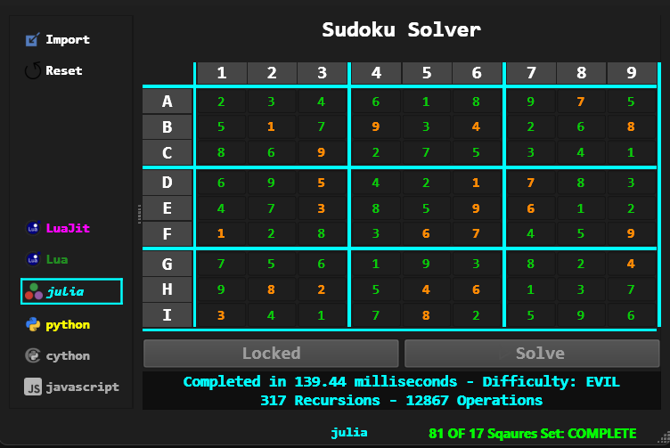

# My Sudoko Practice Project
Using sudoku as a sample problem to learn the essential parts of some new languages and tools

## Purpose

| **General**          | **Python 3.13+**     | **Julia 1+**         | **LuaJit/Lua**       |  **Javascript?**       |   **Fortran?**       | 
| :------              | :------             | :------             | :------             | :------             | :------             |
| <ul><li>- [ ] packaging and building</li></ul> | <ul><li>- [x] PyQt6 Ui</li></ul>              | <ul><li>- [x] Beginner syntax</li></ul>       | <ul><li>- [x] Beginner syntax</li></ul>  |  <ul><li>- [ ]  </li></ul> | <ul><li>- [ ]  </li></ul> |
| <ul><li>- [x] project.toml setup </li></ul>| <ul><li>- [x] logging</li></ul>            | <ul><li>- [x] Pkg </li></ul>   | <ul><li>- [ ] Luarocks </li></ul>                     |  <ul><li>- [ ]  </li></ul> | <ul><li>- [ ]  </li></ul> |
| <ul><li>- [x] virtual environments </li></ul> | <ul><li>- [x] enums </li></ul> | <ul><li>- [x] fast code </li></ul>     |  <ul><li>- [ ] fast code </li></ul>                      |  <ul><li>- [ ]  </li></ul> | <ul><li>- [ ]  </li></ul> |
| <ul><li>- [ ] github actions </li></ul> | <ul><li>- [x] caching </li></ul> | <ul><li>- [ ] modules </li></ul>     |  <ul><li>- [x] tables </li></ul>                      |  <ul><li>- [ ]  </li></ul> | <ul><li>- [ ]  </li></ul> |
| <ul><li>- [ ] code structure </li></ul> | <ul><li>- [x] pythonics  </li></ul> | <ul><li>- [ ] typing </li></ul>     |  <ul><li>- [ ]  </li></ul>                       |  <ul><li>- [ ]  </li></ul> | <ul><li>- [ ]  </li></ul> |
| <ul><li>- [x] VS Code </li></ul> | <ul><li>- [x] pip </li></ul> | <ul><li>- [ ] benchmarking </li></ul>     |  <ul><li>- [ ]  </li></ul> |  <ul><li>- [ ]  </li></ul> | <ul><li>- [ ]  </li></ul> |
| <ul><li>- [ ] Liscensing </li></ul> | <ul><li>- [x] ruff </li></ul> | <ul><li>- [ ] profiling </li></ul>     |  <ul><li>- [ ]  </li></ul>                      |  <ul><li>- [ ]  </li></ul> | <ul><li>- [ ]  </li></ul> |
| <ul><li>- [x] AI Assistant </li></ul> | <ul><li>- [x] lupa </li></ul> | <ul><li>- [ ]  </li></ul>     |  <ul><li>- [ ]  </li></ul>                      |  <ul><li>- [ ]  </li></ul> | <ul><li>- [ ]  </li></ul> |
| <ul><li>- [ ] unit testing </li></ul> | <ul><li>- [x] juliacall/juliapkg </li></ul> | <ul><li>- [ ]   </li></ul>     |  <ul><li>- [ ]   </li></ul>                      |  <ul><li>- [ ]  </li></ul> | <ul><li>- [ ]  </li></ul> |
| <ul><li>- [ ] autodoc </li></ul> | <ul><li>- [ ]  </li></ul> | <ul><li>- [ ]  </li></ul>     |  <ul><li>- [ ]  </li></ul>                      |  <ul><li>- [ ]  </li></ul> | <ul><li>- [ ]  </li></ul> |
| <ul><li>- [ ] typing </li></ul> | <ul><li>- [ ]  </li></ul> | <ul><li>- [ ]  </li></ul>     |  <ul><li>- [ ]  </li></ul>                      |  <ul><li>- [ ]  </li></ul> | <ul><li>- [ ]  </li></ul> |

## Sudoku 

## Solution Method

